<div id="top"></div>

<!-- PROJECT LOGO -->
<div align="center">


[![Contributors][contributors-shield]][contributors-url]
[![Forks][forks-shield]][forks-url]
[![Stargazers][stars-shield]][stars-url]
[![Issues][issues-shield]][issues-url]
<!--  -->

# STMinerProxy

  <p align="center">
    <h3>:zap: 原创编写，功能强大，性能强劲。支持无损BTC ETC ETH LTC ERG CFX RVN SERO XMR CKB BEAM ALPH KASPA等多个币种抽水，不爆内存，体验拉满，8000台无压力不崩溃，精确到单台设备的24小时数据统计、自定义隧道推送工具等强大功能...</h3>
    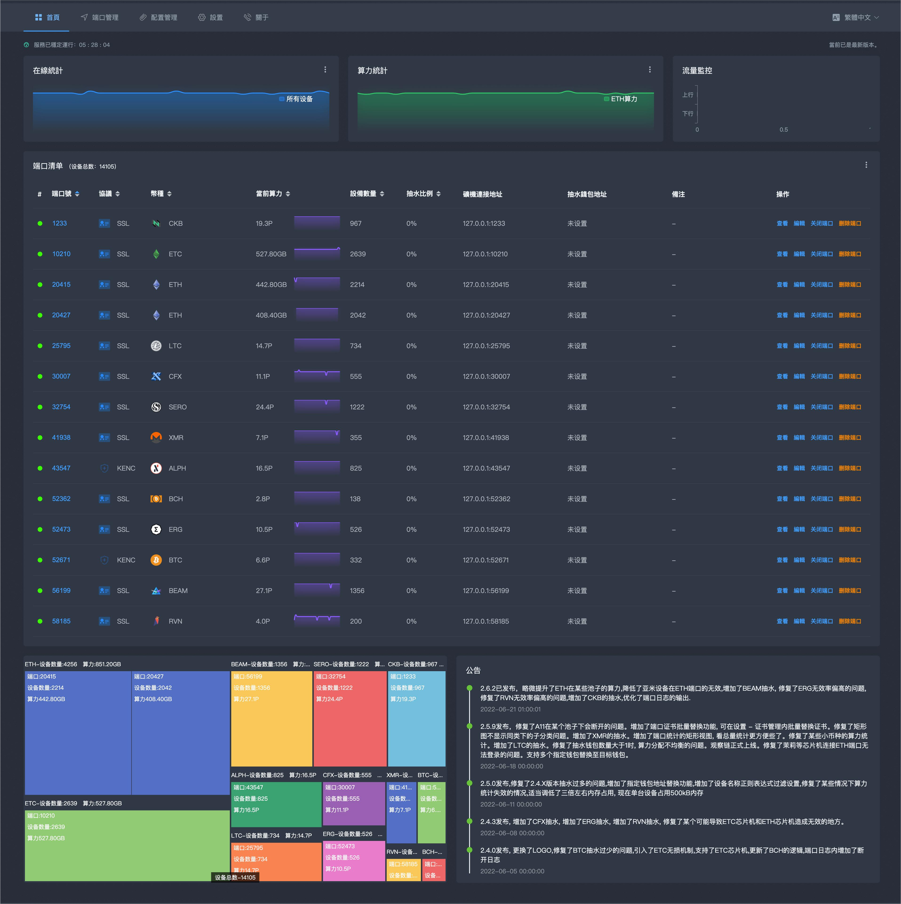
    <a href="https://kdocs.cn/l/slPG1q488Trc"></a>
    TG：<a href="https://t.me/stminer">https://t.me/stminer</a>
    <h3>法律不支持的地区此程序无法使用，请自觉遵守当地相关政策，使用此软件造成的法律问题，一概与软件作者无关。</h3>
  </p>
</div>

# Linux

```
root用户直接执行以下命令, 根据提示选择对应功能即可。

bash <(curl -s -L https://raw.githubusercontent.com/stminer/stminer/main/linux-install.sh)
```
# 导航

<ol>
<li>
    <a href="#uplog">更新日志</a>
</li>
<li>
    <a href="#gn">功能</a>
</li>
<li>
    <a href="#preview">软件预览</a>
</li>
<li>
    <a href="#install">部署软件</a>
    <ul>
        <li>
            <a href="#linux">Linux</a>
            <ul>
                <li>
                    <a href="#linux">安装</a>
                </li>
                <li>
                    <a href="#linux">更新</a>
                </li>
                <li>
                    <a href="#linux">卸载</a>
                </li>
                <li>
                    <a href="#linux">停止服务</a>
                </li>
                <li>
                    <a href="#linux">启动服务</a>
                </li>
                <li>
                    <a href="#linux">重启服务</a>
                </li>
                <li>
                    <a href="#linux">开机启动</a>
                </li>
                <li>
                    <a href="#linux">设置最大连接数</a>
                </li>
                <li>
                    <a href="#linux">查看程序运行时日志</a>
                </li>
            </ul>
        </li>
        <li>
            <a href="#windows">Windows</a>
        </li>
    </ul>
</li>
<li>
    <a href="#about">常见问题</a>
    <ul>
        <li>
            <a href="#q15">内存相关</a>
        </li>
        <li>
            <a href="#q0">进程守护</a>
        </li>
        <li>
            <a href="#q1">默认账号密码</a>
        </li>
        <li>
            <a href="#q1">算力呈现波浪状</a>
        </li>
        <li>
            <a href="#q2">负载均衡</a>
        </li>
        <li>
            <a href="#q3">安装时提示 curl: command not found</a>
        </li>
        <li>
            <a href="#q4">修改端口启动</a>
        </li>
        <li>
            <a href="#q5">修改密码</a>
        </li>
        <li>
            <a href="#q6">启动时提示 dial tcp connection refused</a>
        </li>
        <li>
            <a href="#q7">关闭/删除端口</a>
        </li>
        <li>
            <a href="#q8">安装时提示：安装killall失败！！！！请手动安装psmisc后再执行安装程序。</a>
        </li>
        <li>
            <a href="#q9">WEB访问长时间卡在LOADING界面。</a>
        </li>
        <li>
            <a href="#q11">IP黑名单</a>
        </li>
        <li>
            <a href="#q12">ETH芯片机</a>
        </li>
        <li>
            <a href="#q13">本地算力修改</a>
        </li>
        <li>
            <a href="#q14">迁移</a>
        </li>
        <li>
            <a href="#q10">开发费用及算力损失问题</a>
        </li>
    </ul>
</li>
<li><a href="#about">免责声明</a></li>
<li><a href="#about">联系我们</a></li>
</ol>

<span id="uplog"></span>
# 更新日志

```
2.8.0
[重要更新] [安全性更新]
修复了一个严重的安全漏洞, 更新完记得修改【账号】和【密码】
2.7.9
增加了dcr抽水（兼容模式）
优化了etc、kaspa、bch、erg里一个可能发生错误的问题
2.7.8
增加了针对某一台设备的抽水比例修改
增加了备用抽水地址

```

# 功能

|支持的功能|支持的币种|
|:-------:|:---:|
|精确到单台设备的24小时数据统计分析|ETH|
|TLS/SSL/KENC加密|ETC|
|矿池转发|BTC|
|预置各币种的矿池（随时更新）|KDA|
|自定义矿池|ZEC|
|备用矿池|BEAM|
|自定义端口|RVN|
|端口连接数限制|ERG|
|多钱包配置|ZEN|
|自定义抽水比例|LTC|
|自定义抽水钱包、矿池、设备名称|DCR|
|统一钱包|DASH|
|矿池模式|CKB|
|端口备注|BCH|
|在线更新|HNS|
|导入导出端口配置|STC|
|自定义SSL密钥||
|矿池状态检查||
|自定义TLS证书||
|IP黑名单||
|CC策略||
|修改矿池内本地算力||

</p>

# 软件预览

<p id="preview"></p>

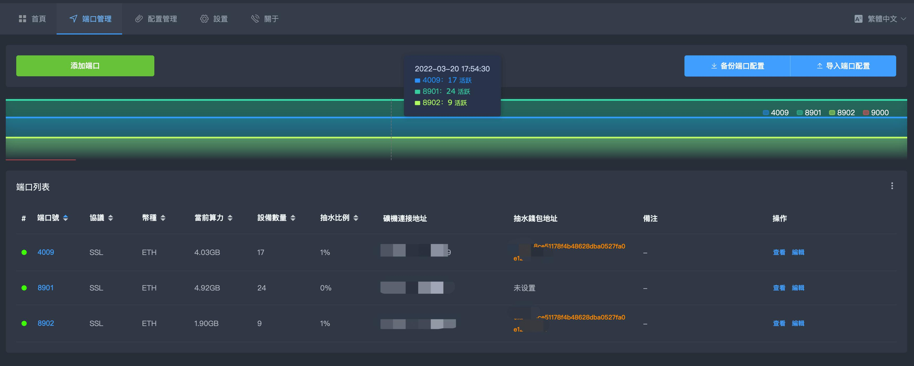
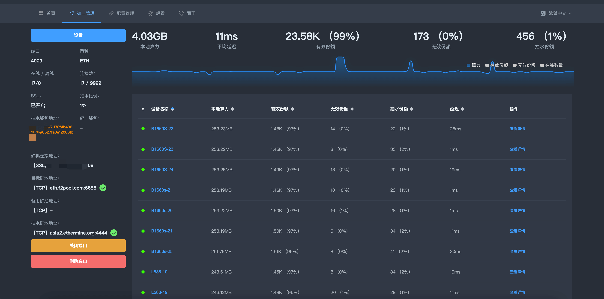
<!-- 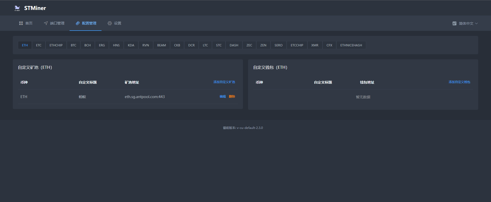 -->
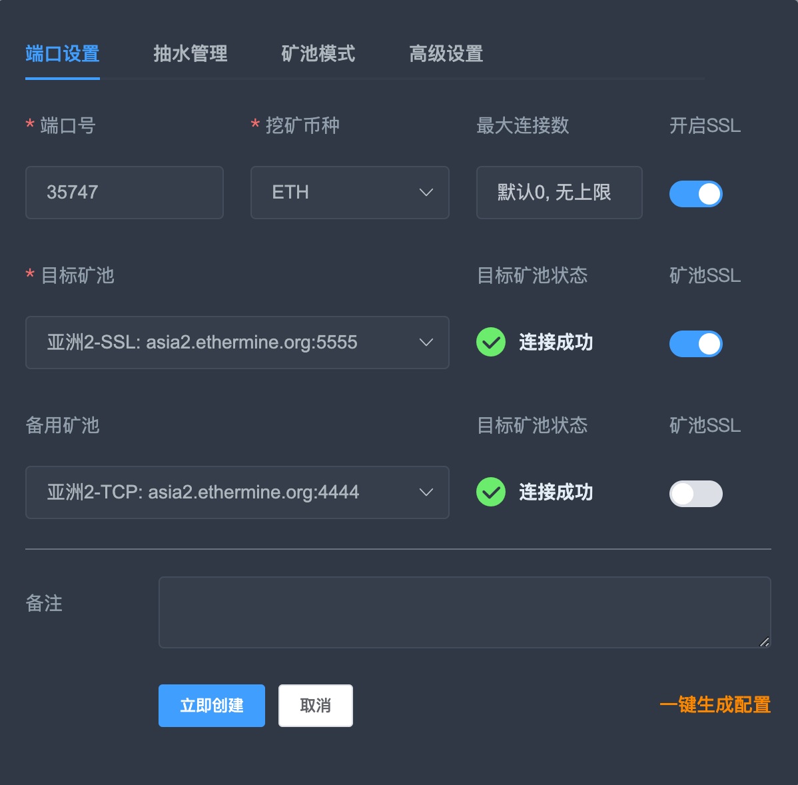
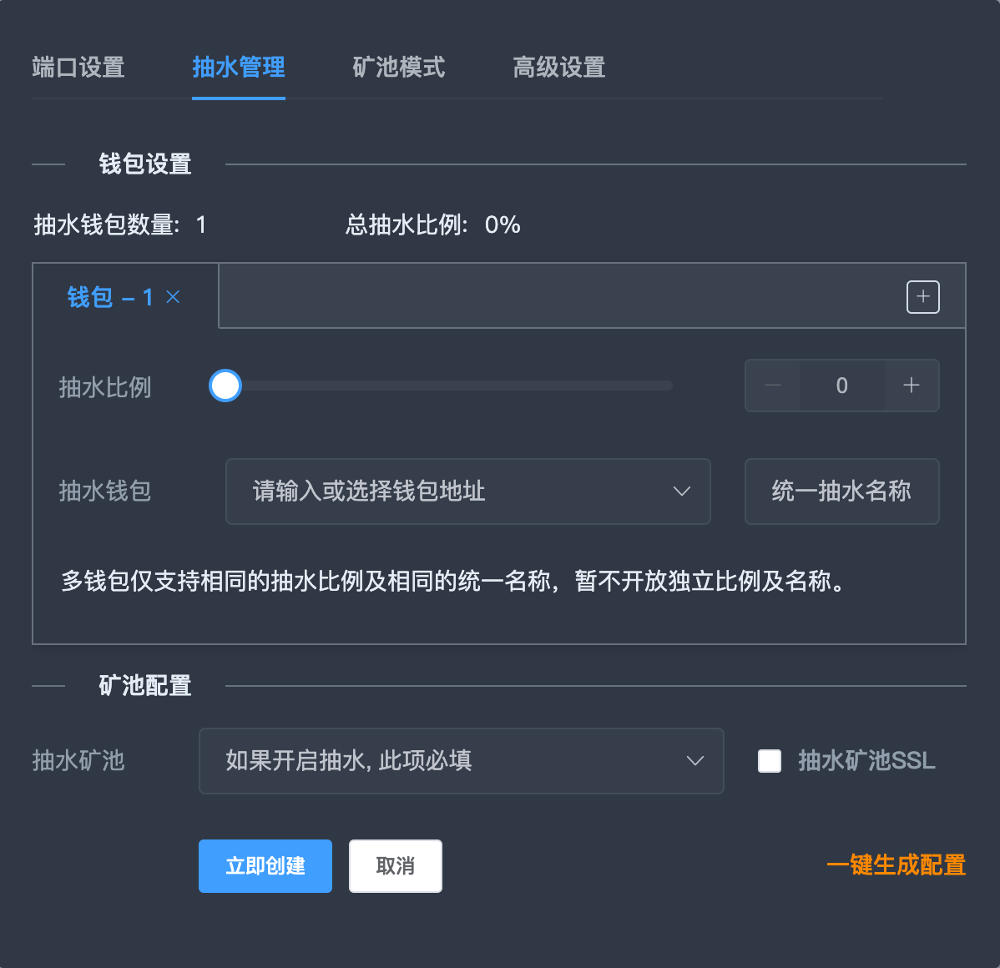
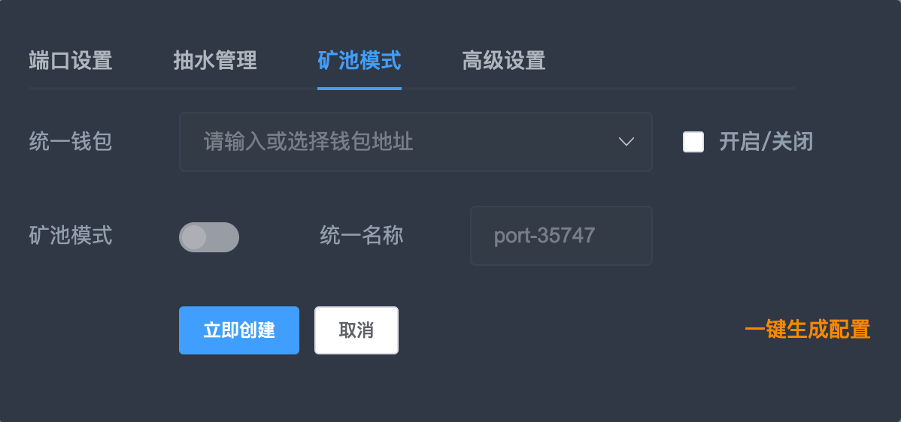
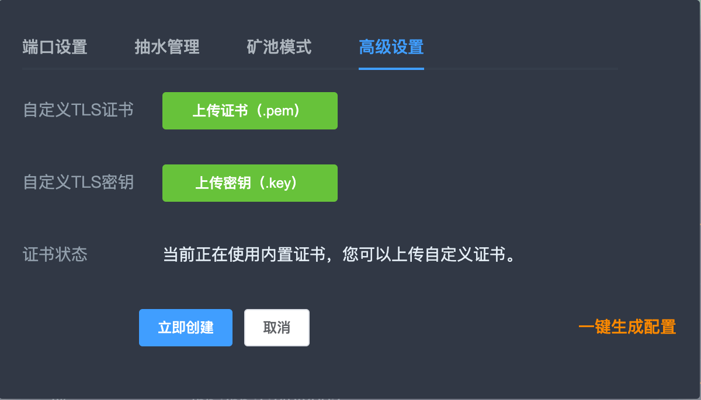

<!-- GETTING STARTED -->
<p id="install"></p>


<p id="linux"></p>


### 安装完成之后, 请立即修改登录账号、密码以及启动端口，防止被爆破。

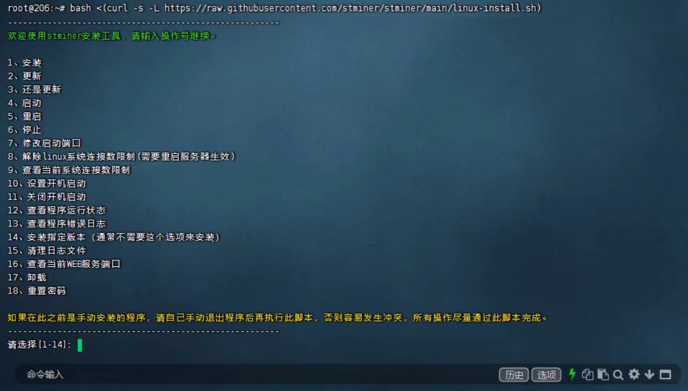

支持的Linux

* Ubuntu 64 18.04+
* Centos 64 7+

<p id="windows"></p>

# Windows
下载完后直接启动即可，程序自带进程守护

<a href="https://github.com/stminer/stminer/tree/main/Windows-64">下载地址</a>


<p id="question"></p>
<p id="about"></p>

___

<span id="q0"></span>
> # 常见问题
>>## 进程守护
>>>程序自带了进程守护, 不要！不要！不要使用supervisor或相关工具维护进程，否则会导致进程重复开启。
>><span id="q1"></span>
>>## 算力呈现波浪状
>>>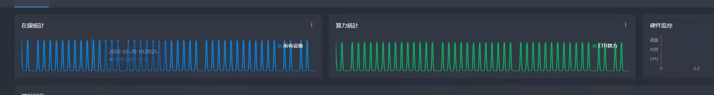<br>
>>>
>>>如果出现上图中的情况, 说明您开启了多个相同端口的KTMinerproxy, 关闭多余的进程即可。
>>>
>>>如果您进行了镜像拷贝，也会出现以上问题，先执行脚本停止程序的运行，然后删除掉/root/ktmproxy/license文件, 再执行启动即可
>><span id="q2"></span>
>>## 负载均衡
>>>等待更新
>><span id="q3"></span>
>>## 安装时提示 curl: command not found
>>>安装时提示 curl: command not found， 说明你的linux没有安装curl
>>>先执行    apt-get update
>>>然后执行  apt install curl
>>>等待命令执行完毕，即可执行暗转脚本
>><span id="q4"></span>
>>## 修改端口启动
>>>执行安装脚本，选择修改端口启动，输入要修改的端口号即可。
>><span id="q5"></span>
>>## 修改密码
>>>安装完后请尽快前往设置页修改密码。
>><span id="q6"></span>
>>## 启动时提示 dial tcp connection refused
>>>请将stproxy.com添加至防火墙白名单中，这个域名提供了图表服务及认证
>><span id="q7"></span>
>>## 关闭/删除端口
>>>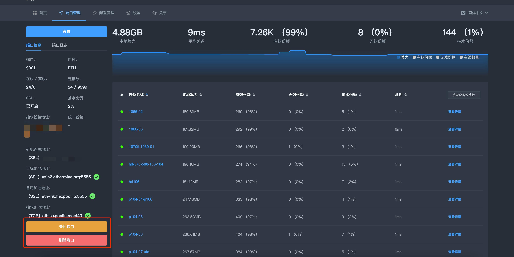
>>>
>>>点击图中指定位置即可删除/关闭端口
>><span id="q8"></span>
>>## 安装时提示：安装killall失败！！！！
>>>检查服务器的镜像源并手动安装psmisc
>><span id="q9"></span>
>>## WEB访问长时间卡在LOADING界面。
>>>安装或更新后，第一次访问web界面加载时间可能会有些长，如果很长时间没有进去，请更换chrome浏览器。
>><span id="q1"></span>
>>## 默认账号密码
>>>默认账号: admin
>>>默认密码: admin123
>><span id="q10"></span>
>>## 开发费用及算力损耗
>>>开发费用恒定至千分之二
>>>
>>>多种原因会造成算力损耗，检查以下项，不要什么屎盆子都往开发者头上扣
>>>
>>>观察矿池内延迟份额的比例，如果延迟率高于百分1请ping服务器检查延迟
>>>
>>>抽水的算力因池而异，如果两个池子难度不同，也会导致算力差异
>><span id="q11"></span>
>>## IP黑名单
>>>
>>> 前往设置页面, IP黑名单选项卡可主动加入IP黑名单
>>>
>>>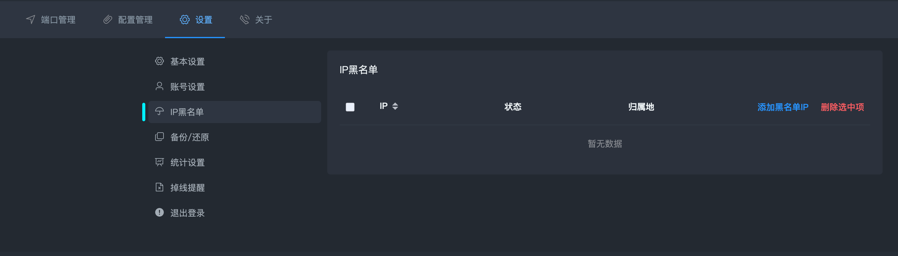
>>>
>><span id="q12"></span>
>>## ETH芯片机
>>>
>>> 如果ETH芯片级在ETH端口无法正常工作(例如芯动系列), 可以在添加端口时币种选择ETH芯片机
>>>
>><span id="q13"></span>
>>## 本地算力修改
>>>
>>> 添加或编辑端口时, 在【高级】选项卡下可进行ETH、ETC的本地算力修改
>>>
>><span id="q14"></span>
>>## 服务迁移
>>>
>>> 无论使用任何方式迁移程序, 迁移之后请将新的目录下license文件删除, 然后重启程序
>>>
>><span id="q15"></span>
>>## 内存相关
>>>
>>> 目前单台设备内存占用峰值控制在1.5M, 处于长期观察调整阶段, 之后会根据实际情况调低占用, 请根据接入设备数量来决定硬件配置
>>>
>> -end-
>>
> -end-

# 免责声明
<p id="flsm">
开发者仅在技术及爱好的驱使下维护此软件，本软件仅验证技术过程。

用前请遵循当地法律，不允许的区域内禁止使用。

使用此软件造成的法律问题, 一概与软件作者无关。
</p>


# 联系我们

电报: [https://t.me/stminer](https://t.me/stminer)
企鹅群：126666463

<p align="right">(<a href="#top">back to top</a>)</p>


[contributors-shield]: https://img.shields.io/github/contributors/stminer/stminer.svg?style=flat
[contributors-url]: https://github.com/stminer/stminer/graphs/contributors
[forks-shield]: https://img.shields.io/github/forks/stminer/stminer.svg?style=flat
[forks-url]: https://github.com/stminer/stminer/network/members
[stars-shield]: https://img.shields.io/github/stars/stminer/stminer.svg?style=flat
[stars-url]: https://github.com/stminer/stminer/stargazers
[issues-shield]: https://img.shields.io/github/issues/stminer/stminer.svg?style=flat
[issues-url]: https://github.com/stminer/stminer/issues
[license-shield]: https://img.shields.io/github/license/stminer/stminer.svg?style=flat
